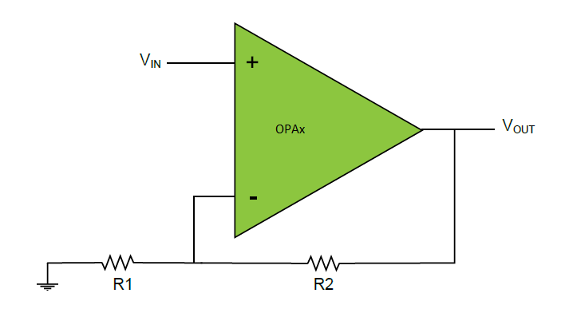

# Getting started with Mindi® simulation and PIC18-Q41 microcontrollers
This guide will get you up and running with simulating the analog OPAMP module in PIC18-Q41 family devices using the Mindi simulation tool. **For more information about getting started with and using the MPLAB Mindi Analog Simulator please refer to the following resources:**

- [Using the MPLAB Mindi Analog Simulator with the 8-Bit Operational Amplifier Module Technical Brief](https://ww1.microchip.com/downloads/en/DeviceDoc/Using-the-MPLAB-Mindi-Analog-Simulator-with-the-8-Bit-Operational-Amplifier-Module-90003293A.pdf)
- [Microchip Developer - Introduction to MPLAB Mindi Analog Simulator](https://microchipdeveloper.com/mindi:mindi-analog-simulator-introduction)
- [Getting Started with the MPLAB Mindi Analog Simulator Document](http://ww1.microchip.com/downloads/en/DeviceDoc/Getting-Started-MPLAB-Mindi-Analog-Simulator-DS50002564B.pdf)

## Configuration: Non-Inverting Programmable Gain Amplifier (PGA)
The Non-Inverting Programmable Gain Amplifier is a configuration with run-time selectable positive gain.

### Mindi Simulation

Download and open the follower **Mindi schematic [here](schematics/Non_inverting_PGA.wxsch)**. Press the _play_ button to simulate with an example stimulus source.

### Adjustment Options
The amplification of the Non-Inverting Programmable Gain Amplifier can be adjusted using any of 8 internal resistor ladder ratio levels by changing the GSEL value in the appropriate OPAxCON register. The table below shows the different gain settings in this mode of operation, and the corresponding GSEL values. This information can also be found in the device datasheet.

|GSEL[2:0]  | R1   | R2   | Non-Inverting (1 + R2/R1)|
|-----------|:----:|:----:|:------------------------:|
|111        | 1R   | 15R  |  16                      |
|110        | 2R   | 14R  |  8                       |
|101        | 4R   | 12R  |  4                       |
|100    	  | 6R   | 10R  |  8/3                     |
|011     	  | 8R   | 8R   |  1                       |
|010        | 12R  | 4R   |  4/3                     |
|001        | 14R  | 2R   |  8/7                     |
|000        | 15R  | 1R   |  16/15                   |

### Updating composer fields
Once the desired result has been verified with Mindi simulation, the corrected values should be moved back into MCC by copying resistor values across to the composer of your preference.

### Don't have Mindi?
Download and install [Mindi simulation tool](https://www.microchip.com/mplab/mplab-mindi) here.
